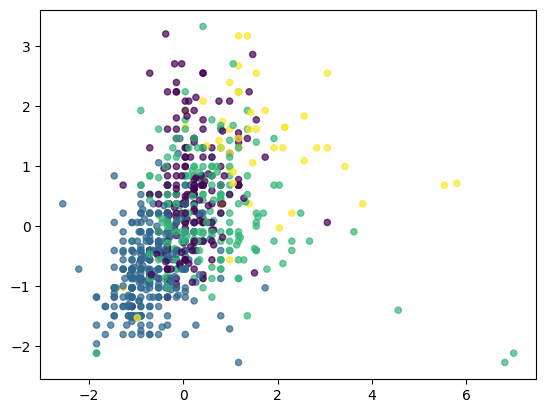
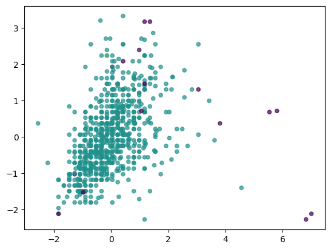

# Online Fraud Detection
This project implements machine learning models to detect fraudulent online transactions.
### Characteristics
- The dataset was highly imbalanced
	- Non-fraudulent transactions: 6,354,407
	- Fraudulent transactions: 8,213
### Data Preprocessing
- Dropped irrelevant columns like `nameOrig` and `nameDest`
- Applied SMOTE to handle the imbalanced classes
- Train-test split: 70-30 ratio
### Pipeline
- **Numerical Features**: Scaled using `StandardScaler`
- **Categorical Features**: One-hot encoded and scaled
- **Column Transformer**: Combined preprocessing for different feature types
### Training Results

| Training Models                | Accuracy | Precision | Recall   | F1       | AUC      |
| ------------------------------ | -------- | --------- | -------- | -------- | -------- |
| Decision Tree Classifier       | 0.999384 | 0.684527  | 0.969562 | 0.802486 | 0.984492 |
| Decision Tree Classifier Tuned | 0.999389 | 0.686494  | 0.969562 | 0.803836 | 0.984495 |
| Random Forest Classifier       | 0.999212 | 0.626582  | 0.964286 | 0.759591 | 0.981771 |
k
Tuned decision tree model performed the best overall

# Clustering
### Kmeans

### DBSCAN
